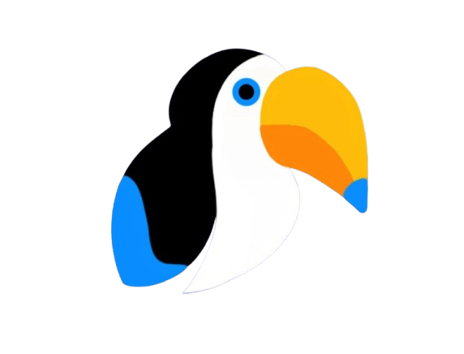

<h1 align="center" text="times">KALEB</h1>

Este é um projeto de conclusão de curso de desenvolvimento de sistemas 🦜

   

    
 
 
<h3  >Linguagens Utilizadas</h3>
  
 
 
<h2 >🧑‍💻 Autores</h2>
<table>
  <tr>
    <td align="center">
    
       <a href="https://github.com/beaxx"><b>Beatriz Oliveira</b></a>
       <small>Desenvolvedora</small>
    </td>
    <td align="center">
      
       <a href="https://github.com/Gigiovh"><b>Giovanna Clemente</b></a>
       <small>Desenvolvedora</small>
    </td>
    <td align="center">
      
       <a href="https://github.com/leticiaamaro">Letícia Amaro</b></a>
       <small>Desenvolvedora</small>
    </td>
     <td align="center">
      
       <a href="https://github.com/Lale-Araujo"><b>Laura Letícia</b></a>
       <small>Desenvolvedora</small>
    </td>
  </tr>
</table>
  
</ul>
   
  </tr>
</table>

